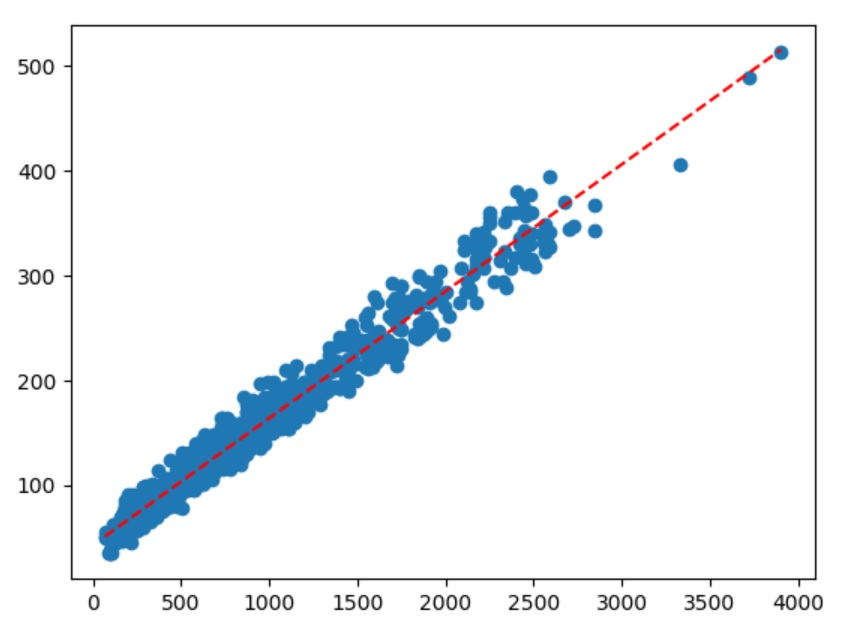

# Data Science Course
My work on the Data Science Mini-Degree by Zenva Academy

[2 - Learn Python Programming by Making a Game](https://andoeme.github.io/datascience/2_learn_python_programming_by_making_a_game.py)
This chapter teaches basic concepts of Python. A nice refresher to me were tuples, lists and dictionaries. 
**The final project is a game using PyGame. I haven't finished that one yet, but will upload it in the future.**

[3 - Numpy Matrices and Vectors](https://andoeme.github.io/datascience/3_numpy_matrices_and_vectors.py)
Learning about matrices in this course was interesting. Matrices aren't complex, but I learnt something new here: how to multiply them.

[4 - Web Scraping with Python and BeautifulSoup](https://andoeme.github.io/datascience/4_web_scraping_with_python_and_beautifulsoup.py)
I was excited about the web scraping part. I learnt how to scrape data from a webpage, how to filter the data and write it readable to a file.
I worked with table and non-table data. The table-data was written to a CSV file and I imported it to Excel. It looks great!

[5 - Reading Data from APIs with Python](https://andoeme.github.io/datascience/5_reading_data_from_apis_with_python.py) Further Scraping with JSON and XML data using APIs. Writing to CSV files as well.

[6 - Beginning SQL - Store and Query Your Data](https://andoeme.github.io/datascience/6_beginning_sql_store_and_query_your_data.py) This lecture was about connection to a database and fetching data in Python using SQLite. Finally I store the results in a CSV file. Since I worked before with SQL and databases in C#, I treated this lecture as a refresher. With Python this is far easier. I look forward to the next chapter!

[7 - Intermediate SQL - Create and Alter Databases](https://andoeme.github.io/datascience/7_intermediate_sql_create_and_alter_databases.py) I l jiked learning more about foreing keys and practiving inner joins. Next up is working with Pandas!

[8 - Data Manipulation with Pandas](https://andoeme.github.io/datascience/8_data_manipulation_with_pandas.py) This has been the most boring lecture so far. A lot of topics in Lecture 3 were covered again. Only a few new methods were introduced like opening a Excel or CSV file or vizualising dataframes. Next lesson hopefully gets more intriguing.

[9 - Data Analysis wiwth Python](https://andoeme.github.io/datascience/9_data_analysis_with_python.py) Wow, this lecture was intense! It introduced me to Statistics and teached me how to plot, join data and calculate Linear Regression. A bonus was to learn how prediction with slope and intercept work.

**There are only 4 more chapters left in this course and I'll upload them as soon as I complete the tasks. I'm looking forward to working with Pandas.**
